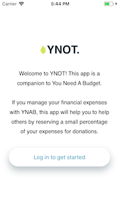
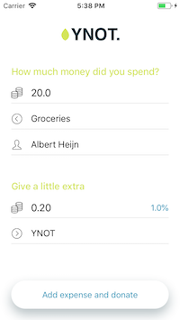

# YNOT
YNOT is a functional proof-of-concept iOS app using the YNAB API. It was built as a submission to the [YNAB API contest](https://www.youneedabudget.com/contest-ynab-api/)

YNOT does only 1 thing. It lets you input your financial transactions into YNAB and at the same time lets you put away a percentage of that transaction to donate to a good cause later on. After all, if you're spending money, YNOT think of others?

## Screenshots

## Building and running the app

### Requirements
- XCode 9.4
- iOS 11.0
- Cocoapods

### Build instructions
- Execute 'pod install' from the commandline to install the required libraries.
- Open YNOT.xcworkspace in Xcode
- Run the app on a simulator or device

## Limitations
YNOT uses the YNAB API. This api is currently mainly geared towards server sided applications. This has some consequences.

1) The oAuth authorization used in the app expires after two hours. In practise, this means that a user who would install the app on his phone would probably have to log into YNAB everytime he wants to log a transaction in YNOT.

2) YNOT wants to move a small percentage of your expenses to a special donation category. However, the YNAB API does not have endpoints (yet?) to move money between categories. To circumvent this limitation, YNOT currently makes 2 fake transactions whenever you log a transaction and a donation. 1 transaction to remove money from your expense category, and a separate transaction to move money back into your donation category.
